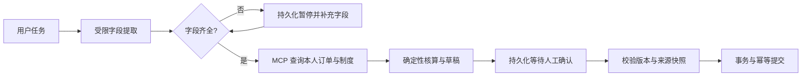

# EnterpriseFlow：企业业务流程 Agent 编排与执行平台

[](https://github.com/fangyunok/enterprise-flow-agent/actions/workflows/ci.yml)

**用 LangGraph 状态图编排企业业务流程的 Agent 平台**：把任务解析、制度检索、MCP 工具调用、人工确认与事务提交组织成可持久化、可中断、可恢复的工作流。内置**差旅费用申请流程**贯通字段补充、制度检索、草稿核算、人工确认与事务提交，全程可核对。

模型只负责提取用户明确提供的字段；身份、租户、金额、制度适用范围与提交许可全部由服务端确定性业务代码裁定。`fixture` 模式无需模型服务即可完整运行，每次运行都输出 `model_used` 标识。

在此之上另有一个**只读 Agent 层**：有界 ReAct 规划循环按需调用查询与核算工具，Supervisor 再派发三个最小权限角色做订单核对、条款检索与确定性核算，并对结论做交叉检查。这一层只会调用只读工具，写入类工具在执行前就被规划器拦下——创建、确认与提交仍然只走人工确认流程。

网页同时提供只读制度问答：检索授权范围内的条款后，Qwen/API 模式生成带引用的答案，并逐条校验来源 ID 与原文片段，结果标记为待人工复核；`fixture` 模式直接返回条款原文与来源预览。


截图取自本地实时运行的网页，停在真实的审批暂停点。

## 先看结论

| 问题 | 结论 | 证据 |
| --- | --- | --- |
| 是否使用真实 Agent 编排框架 | LangGraph 1.2.12 真实 `StateGraph`；字段补充与审批通过 `interrupt` / `Command` 暂停与恢复，不是 if/else 流水线 | [架构](docs/ARCHITECTURE.md) |
| 中断的任务能否恢复 | `AsyncSqliteSaver` 文件检查点，进程重启后按同一 `run_id` 读回原暂停点继续；`demo` 命令重复恢复后申请编号保持一致 | [验证记录](docs/EVALUATION.md) |
| 模型能否越权 | 模型可输出字段仅限订单 ID、成本中心、日期、目的地、备注；身份、租户、金额与制度适用由服务端判定，MCP 工具服务器绑定服务端身份，参数中不含员工或租户字段 | [架构](docs/ARCHITECTURE.md) |
| 旧确认与重复提交如何处理 | 草稿绑定版本号与 SHA256 内容摘要，编辑草稿或来源变化后旧确认立即失效；写事务 + 唯一约束 + 幂等键，重复提交返回同一编号 | [架构](docs/ARCHITECTURE.md) |
| 记忆机制如何分层 | 长期偏好（用户显式保存的成本中心跨任务复用）与单任务短期状态分离；当前显式字段优先于已存偏好，偏好复用前再通过一次权限检查 | [架构](docs/ARCHITECTURE.md) |
| Agent 能否自己决定调什么工具 | 可以，但在只读白名单内：有界 ReAct 循环按需查询与核算，步数、上下文与循环检测同时生效；对写入工具的提议在执行前被拦下，实测 30 次全部 `blocked_tool` 且工具调用为 0 | [Agent 层](docs/AGENT_LAYER.md) · [测量记录](results/agent_layer_benchmark.md) |
| 多角色结论冲突时听谁的 | 三个最小权限角色分别产出结论，Supervisor 做交叉检查并按 blocking / warning 分级；条款同日多版本、制度缺口、订单不符合条件都会阻塞，订单数不一致只告警并以业务服务为准 | [Agent 层](docs/AGENT_LAYER.md) |
| 制度检索的召回质量如何 | 权限先由结构化过滤收窄（候选集 P50 34 条 / 最大 52 条），再排序：BGE-M3 稠密召回把 Recall@3 从 0.730 提到 0.836、Recall@5 从 0.898 提到 0.987，三种配置的越权泄漏均为 0 | [检索评测](results/retrieval_eval.md) |
| 检索后端是否可替换 | 向量库本地 FAISS 与 Milvus 同一套接口，编码器支持本地 sentence-transformers 与 OpenAI 兼容 HTTP 服务，reranker 支持本地交叉编码器与 TEI `/rerank`；未配置模型服务时保持关键词路径 | [GPU 部署](deploy/gpu/README.md) |
| 模型抽取质量怎么衡量 | 27 条人工标注用例覆盖显式标识、缺失字段、格式噪声、身份伪造与提示注入，输出字段级 P/R/F1、幻觉字段数与弃答率；评测调用与线上相同的 `HttpExtractor` | [模型评测](results/model_eval.md) |
| 有没有服务化与可观测性 | `serve-api` 提供 FastAPI + OpenAPI 契约、异步任务提交与依赖就绪检查；每次运行记录各阶段决策点、耗时分布与 token 用量，费率由配置注入 | [架构](docs/ARCHITECTURE.md) |
| 结果是否可验证 | 182 项测试（业务 20 / 编排 22 / 网页 21 / 问答 5 / 只读规划 24 / 多角色 22 / 检索 30 / 可观测性 17 / API 21）+ Ubuntu·Windows × Python 3.11·3.12 四组 CI 全部通过 + 脱离源码目录的 wheel 安装与 HTTP 检查 | [验证记录](docs/EVALUATION.md) · [CI 运行记录](https://github.com/fangyunok/enterprise-flow-agent/actions/runs/37118933475) |

## 五分钟运行

需要 Python 3.11 或 3.12。在项目目录执行：

```powershell
git clone https://github.com/fangyunok/enterprise-flow-agent.git
cd enterprise-flow-agent
python -m venv .venv
.\.venv\Scripts\python.exe -m pip install -r requirements.lock.txt
.\.venv\Scripts\python.exe -m pip install -e ".[dev]"
.\.venv\Scripts\python.exe -m enterprise_flow doctor --mode fixture
.\.venv\Scripts\python.exe -m enterprise_flow demo --db runs/demo.sqlite --mode fixture
.\.venv\Scripts\python.exe -m enterprise_flow plan --db runs/demo.sqlite --mode fixture
.\.venv\Scripts\python.exe -m enterprise_flow collaborate --db runs/demo.sqlite --mode fixture
.\.venv\Scripts\python.exe -m enterprise_flow serve --db runs/web.sqlite --mode fixture
```

Linux/macOS 使用 `.venv/bin/python` 替换上述解释器路径。打开 `http://127.0.0.1:7861`，登录 Alice，再输入：
> 我于 2026-10-09 至 2026-10-11 去广州出差，请处理 alice-hotel-001 和 alice-train-001，成本中心 CC-ALPHA-OPS。

示例住宿为 860 元、两晚，制度上限每晚 400 元；铁路订单 430 元。草稿显示原始金额 **1290 元**、可申请金额 **1230 元**、超额 **60 元**，并列出条款版本。确认当前草稿后创建申请编号。

命令行 `demo` 会关闭并重新打开 LangGraph 引擎，读取同一审批检查点，再确认提交，最后重复恢复一次并验证申请编号一致。

`plan` 打印只读规划轨迹：每一步的工具、参数、观察摘要，以及停止原因、工具调用次数与回注上下文字符数。`collaborate` 打印三个角色的结论、交叉检查结果、候选条款和 `content_digest`，并附带 `draft_count_after_analysis`。两条命令都不产生业务写入。

## 工程能力

| 能力 | 实现 |
| --- | --- |
| 流程编排 | 真实 LangGraph 状态图，字段补充和审批使用 `interrupt`/`Command` |
| 持久化恢复 | `AsyncSqliteSaver` 文件检查点，业务库与检查点库分开 |
| MCP 集成 | 官方 SDK 内存传输；每个工具服务器绑定服务端身份，不接受模型传入员工或租户身份 |
| 制度检索 | SQL 先按租户、部门和生效日期过滤，再排序；支持关键词、向量召回（FAISS / Milvus）与交叉编码器精排，融合用 RRF，计算结果引用确定适用的条款 |
| 制度问答 | MCP 检索后读取模型 JSON 答复，验证回答片段和来源片段；问答不执行业务写操作 |
| 费用核算 | 金额使用整数分；住宿按晚拆分并选择当日制度；冲突或证据缺失时阻止办理 |
| 版本确认 | 草稿版本与 SHA256 内容摘要绑定；编辑草稿或来源变化后旧确认失效 |
| 事务提交 | SQLite 写事务、唯一约束和幂等键；重复提交返回同一编号 |
| 长期偏好 | 用户明确保存的成本中心可跨任务复用；当前字段优先，支持修改和删除 |
| 只读规划循环 | 有界 ReAct：步数 / 上下文字符 / 循环签名三重限制；观察只以摘要回注，写入工具在执行前被白名单拦下 |
| 多角色协作 | Supervisor + 三个最小权限角色，黑板交接订单范围，结论交叉检查并按 blocking / warning 分级 |
| 可复现测量 | `scripts/benchmark_agent_layer.py` 输出 P50 / P95、工具调用数与业务写入计数；`evaluate_retrieval.py` 与 `evaluate_model.py` 输出召回、P/R 与逐用例失分原因，脚本内断言与结论同时成立 |
| 网页与接口 | Starlette 同源写请求保护、签名会话、来源对照和任务恢复；FastAPI 服务提供 OpenAPI 契约、异步任务提交与依赖就绪检查 |
| 可观测性 | 运行级 trace 记录每个决策点的类别、耗时、状态与明细，按阶段汇总；token 用量与费用按配置费率核算，未返回用量的调用单独计数而非按零计价 |
| 质量门禁 | 检索与模型评测共用线上代码路径，可作为 CI 阈值拦住质量退化；GPU 一键复现见 [deploy/gpu](deploy/gpu/README.md) |
| 交付 | 打包数据与锁定依赖、跨系统 CI、脱离源码目录的 wheel 运行与 HTTP 检查；检索与 API 为可选 extras，基础安装保持轻量 |



## 模型配置

Qwen 和可选 API 都使用 OpenAI 兼容 HTTP 接口。配置读取**进程环境变量**，不会自动加载 `.env`；`.env.example` 仅提供字段参考。

```powershell
$env:ENTERPRISE_QWEN_BASE = 'http://127.0.0.1:11435/v1'
$env:ENTERPRISE_QWEN_MODEL = 'qwen3:4b-instruct'
.\.venv\Scripts\python.exe -m enterprise_flow doctor --mode qwen
.\.venv\Scripts\python.exe -m enterprise_flow serve --db runs/qwen.sqlite --mode qwen
```

`doctor` 会校验目录接口中指定模型是否可用；真实模型不可用时返回明确失败，不会静默降级为离线成功结果。API 模式使用 `ENTERPRISE_API_BASE`、`ENTERPRISE_API_MODEL`、`ENTERPRISE_API_KEY`。

检索后端同样由环境变量决定，未配置时保持关键词路径：

```powershell
$env:ENTERPRISE_RETRIEVAL_MODE = 'hybrid+rerank'
$env:ENTERPRISE_EMBED_BASE = 'http://127.0.0.1:8000'      # BAAI/bge-m3 检索服务
$env:ENTERPRISE_EMBED_MODEL = 'BAAI/bge-m3'
$env:ENTERPRISE_VECTOR_STORE = 'milvus'                  # 或 local（FAISS）
$env:ENTERPRISE_MILVUS_URI = 'http://127.0.0.1:19530'
$env:ENTERPRISE_RERANK_BASE = 'http://127.0.0.1:8080'     # bge-reranker 精排服务
$env:ENTERPRISE_RERANK_MODEL = 'BAAI/bge-reranker-base'
.\.venv\Scripts\python.exe -m enterprise_flow serve --db runs/hybrid.sqlite --mode fixture
```

## 验证与后续演进

```powershell
.\.venv\Scripts\python.exe -m unittest discover -s tests -v
.\.venv\Scripts\python.exe -m pip check
.\.venv\Scripts\python.exe -m build --wheel
```

**182 项测试全部通过**，覆盖身份隔离、制度版本、金额计算、旧确认失效、并发及重复提交、真实 MCP 调用、LangGraph 检查点恢复、HTTP 会话、制度问答引用、只读规划循环的预算与越权阻断、多角色的作用域约束与冲突检测、检索链路的权限边界与降级路径、trace 与成本核算，以及 API 契约与跨身份访问拒绝。Ubuntu/Windows × Python 3.11/3.12 四组 CI 已全部通过，见 [实际运行记录](https://github.com/fangyunok/enterprise-flow-agent/actions/runs/37118933475)。完整验证清单见 [EVALUATION.md](docs/EVALUATION.md)。

评测脚本与线上代码同源，可直接作为质量门禁：

```powershell
# 检索：关键词基线 / 混合召回 / 混合+精排，逐组对比写入同一份报告
.\.venv\Scripts\python.exe scripts\evaluate_retrieval.py --mode keyword
.\.venv\Scripts\python.exe scripts\evaluate_retrieval.py --mode hybrid --append --embedder local --device cpu
.\.venv\Scripts\python.exe scripts\evaluate_retrieval.py --mode hybrid+rerank --append --embedder local --reranker local

# 字段提取：27 条标注用例，--repeat 3 看稳定性，--show-failures 看失分原因
.\.venv\Scripts\python.exe scripts\evaluate_model.py --mode api --repeat 3 --show-failures 10
```

当前结果见 [检索评测记录](results/retrieval_eval.md) 与 [模型评测记录](results/model_eval.md)。GPU 机器上可一键复现全部配置，见 [deploy/gpu](deploy/gpu/README.md)。

服务化与检索增强均为可选 extras，不装也能跑通全部测试：

```powershell
.\.venv\Scripts\python.exe -m pip install -e ".[retrieval,api]"
.\.venv\Scripts\python.exe -m enterprise_flow serve-api --db runs/api.sqlite --mode fixture
```

`serve-api` 在 `http://127.0.0.1:8000` 提供 OpenAPI 文档（`/docs`）、制度检索、异步任务提交与恢复、依赖就绪检查。部署形态为单机可复现运行，随仓库提供完整数据集，`git clone` 后即可复现全部测试与流程。后续演进方向：

- **精排层落地**：在 BGE-M3 召回之上叠加 bge-reranker 交叉编码器，验证「部门专属 vs 全员适用」这类限定语的排序收益，并接入 Milvus 承载标量过滤。
- **服务型存储**：业务后端迁移到服务型数据库，检查点接分布式存储，编排进程水平扩展。
- **真实模型回归**：把字段级 P/R 与越权阻断率设为 CI 阈值，模型或提示词变更导致质量退化时直接拦住。
- **流程扩展**：在同一工具与事务边界上复用采购、资产领用等更多业务流程。

## 目录与后续阅读

```text
src/enterprise_flow/
  database.py       数据库结构与事务
  schemas.py        严格字段与身份契约
  service.py        授权、制度、核算、草稿与提交
  model.py          离线解析与真实模型字段提取
  retrieval.py      结构化过滤、向量召回、RRF 融合与精排
  policy_qa.py      只读制度问答与引用核验
  planner.py        有界只读 ReAct 规划循环
  agents.py         Supervisor 多角色协作与交叉检查
  tools.py          身份绑定的 MCP 工具
  workflow.py       LangGraph 编排与恢复
  observability.py  运行 trace、阶段耗时与 token 成本
  webapp.py         网页、会话和 HTTP API
  api.py            FastAPI 服务与 OpenAPI 契约
  cli.py            seed/demo/plan/collaborate/serve/serve-api/doctor 命令
  data/             wheel 随附内置数据集
tests/              业务和跨层边界测试
data/               可阅读的源数据副本
scripts/            测量与评测脚本（Agent 层、检索、模型抽取）
results/            实测记录（延迟分布、检索召回、抽取 P/R）
deploy/gpu/         Milvus 与嵌入服务编排、一键评测脚本
docs/               架构、Agent 层、评测和投递材料
```

- [架构与失败处理](docs/ARCHITECTURE.md)
- [Agent 层：只读规划与多角色协作](docs/AGENT_LAYER.md)
- [检索评测记录](results/retrieval_eval.md)
- [模型抽取评测记录](results/model_eval.md)
- [GPU 部署与一键评测](deploy/gpu/README.md)
- [验证记录](docs/EVALUATION.md)
- [GitHub 发布与运行](docs/GITHUB_SETUP.md)
- [简历与面试说明](docs/RESUME_ENTRY.md)

MIT 许可覆盖本仓库代码与内置数据集，第三方依赖遵循各自许可证。
