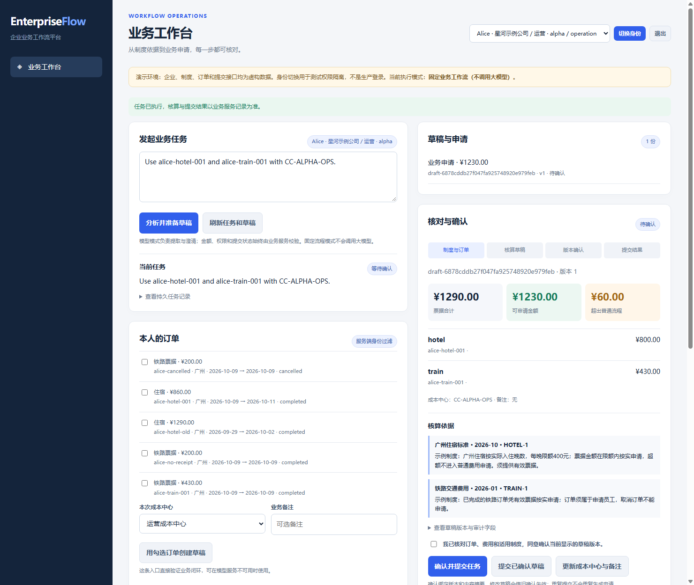
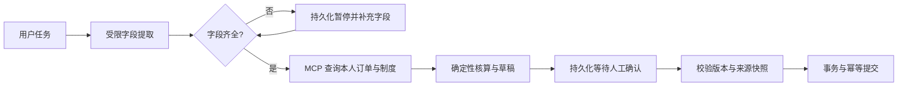

# EnterpriseFlow：企业业务流程编排与执行平台

[](https://github.com/fangyunok/enterprise-flow-agent/actions/workflows/ci.yml)

一个 Python 工程项目：将任务解析、制度检索、业务工具调用、人工确认和事务提交组织成可恢复的工作流。第一条示范流程使用自建数据办理**模拟差旅费用申请**。

模型负责提取用户明确提供的字段；身份、金额、制度适用范围和提交许可由服务端业务代码确定。`fixture` 模式可以离线完整演示，明确记录 `model_used=false`。

网页同时提供只读制度问答：检索授权范围内的条款后，Qwen/API 模式生成带引用的答案，校验来源 ID 与原文片段并标记待人工核查；离线模式直接展示条款，不生成模型答案。



截图来自真实本地网页的审批暂停点，使用合成数据和固定流程模式。

## 五分钟运行

需要 Python 3.11 或 3.12。在项目目录执行：

```powershell
git clone https://github.com/fangyunok/enterprise-flow-agent.git
cd enterprise-flow-agent
python -m venv .venv
.\.venv\Scripts\python.exe -m pip install -r requirements.lock.txt
.\.venv\Scripts\python.exe -m pip install -e ".[dev]"
.\.venv\Scripts\python.exe -m enterprise_flow doctor --mode fixture
.\.venv\Scripts\python.exe -m enterprise_flow demo --db runs/demo.sqlite --mode fixture
.\.venv\Scripts\python.exe -m enterprise_flow serve --db runs/web.sqlite --mode fixture
```

Linux/macOS 使用 `.venv/bin/python` 替换上述解释器路径。打开 `http://127.0.0.1:7861`，选择演示员工 Alice，再输入：

> 我于 2026-10-09 至 2026-10-11 去广州出差，请处理 alice-hotel-001 和 alice-train-001，成本中心 CC-ALPHA-OPS。

示例住宿为 860 元、两晚，制度上限每晚 400 元；铁路订单 430 元。草稿显示原始金额 **1290 元**、可申请金额 **1230 元**、超额 **60 元**，并列出条款版本。只有确认当前草稿后才创建模拟申请编号。没有付款、真实财务审批或外部企业连接。

命令行 `demo` 会关闭并重新打开 LangGraph 引擎，读取同一审批检查点，再确认提交，最后重复恢复一次并验证申请编号一致。

## 工程能力

| 能力 | 实现 |
| --- | --- |
| 流程编排 | 真实 LangGraph 状态图，字段补充和审批使用 `interrupt`/`Command` |
| 持久化恢复 | `AsyncSqliteSaver` 文件检查点，业务库与检查点库分开 |
| MCP 集成 | 官方 SDK 内存传输；每个工具服务器绑定服务端身份，不接受模型传入员工或租户身份 |
| 制度检索 | SQL 先按租户、部门和生效日期过滤，再进行关键词排序；计算结果引用确定适用的条款 |
| 制度问答 | MCP 检索后读取模型 JSON 答复，验证回答片段和来源片段；问答不执行业务写操作 |
| 费用核算 | 金额使用整数分；住宿按晚拆分并选择当日制度；冲突或证据缺失时阻止办理 |
| 版本确认 | 草稿版本与 SHA256 内容摘要绑定；编辑草稿或来源变化后旧确认失效 |
| 事务提交 | SQLite 写事务、唯一约束和幂等键；重复提交返回同一编号 |
| 长期偏好 | 用户明确保存的成本中心可跨任务复用；当前字段优先，支持修改和删除 |
| 网页与接口 | Starlette 同源写请求保护、签名演示会话、来源对照和任务恢复 |
| 交付 | 打包种子数据、锁定依赖、跨系统 CI、脱离源码目录的 wheel 演示与 HTTP 检查 |



## 模型配置

Qwen 和可选 API 都使用 OpenAI 兼容 HTTP 接口。配置读取**进程环境变量**，不会自动加载 `.env`；`.env.example` 仅提供字段参考。

```powershell
$env:ENTERPRISE_QWEN_BASE = 'http://127.0.0.1:11435/v1'
$env:ENTERPRISE_QWEN_MODEL = 'qwen3:4b-instruct'
.\.venv\Scripts\python.exe -m enterprise_flow doctor --mode qwen
.\.venv\Scripts\python.exe -m enterprise_flow serve --db runs/qwen.sqlite --mode qwen
```

`doctor` 只验证目录接口中是否有指定模型，不能代表字段提取质量已通过。真实模型不可用时返回失败，不自动切换为离线成功结果。API 模式使用 `ENTERPRISE_API_BASE`、`ENTERPRISE_API_MODEL`、`ENTERPRISE_API_KEY`。

## 验证与项目范围

```powershell
.\.venv\Scripts\python.exe -m unittest discover -s tests -v
.\.venv\Scripts\python.exe -m pip check
.\.venv\Scripts\python.exe -m build --wheel
```

**63 项测试全部通过**，覆盖身份隔离、制度版本、金额计算、旧确认失效、并发及重复提交、真实 MCP 调用、LangGraph 检查点恢复、HTTP 会话和制度问答引用。Ubuntu/Windows × Python 3.11/3.12 四组 CI 已全部通过，见 [实际运行记录](https://github.com/fangyunok/enterprise-flow-agent/actions/runs/37106022955)。验证范围与真实模型限制见 [EVALUATION.md](docs/EVALUATION.md)。

本版是单机工程演示，使用合成制度、员工和订单。演示登录允许选择模拟身份，不构成正式企业认证。制度检索使用关键词与结构化过滤，未接入向量数据库；流程固定编排，未实现模型自由规划、多智能体或真实企业支付接口。

## 目录与后续阅读

```text
src/enterprise_flow/
  database.py       数据库结构与事务
  schemas.py        严格字段与身份契约
  service.py        授权、制度、核算、草稿与提交
  model.py          离线解析与真实模型字段提取
  policy_qa.py      只读制度问答与引用核验
  tools.py          身份绑定的 MCP 工具
  workflow.py       LangGraph 编排与恢复
  webapp.py         网页、会话和 HTTP API
  cli.py            seed/demo/serve/doctor 命令
  data/             wheel 随附公开合成数据
tests/              业务和跨层边界测试
data/               可阅读的源数据副本
docs/               架构、评测和投递材料
```

- [架构与失败处理](docs/ARCHITECTURE.md)
- [验证记录](docs/EVALUATION.md)
- [GitHub 发布与运行](docs/GITHUB_SETUP.md)
- [简历与面试说明](docs/RESUME_ENTRY.md)

MIT 许可覆盖本仓库代码和自建合成数据，第三方依赖遵循各自许可证。
