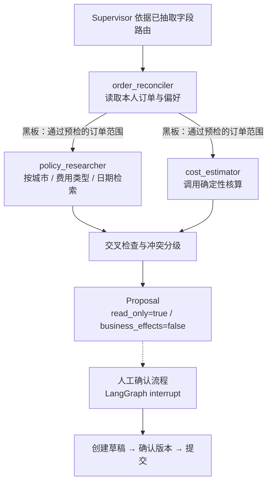

# Agent 层：只读规划与多角色协作

这一层回答两类问题：**「为了给出结论，下一步该查什么」** 和 **「不同角色给出的结论是否互相矛盾」**。
它不回答「要不要提交」，也不具备提交能力。

## 为什么这一层是只读的

固定 LangGraph 流程是唯一能产生业务写入的路径：草稿创建、确认、提交都在人工确认之后，且校验版本号与 SHA256 内容摘要。如果自由规划也能调用写入工具，审批暂停点就形同虚设。

因此工具被分成两个集合，并在模块导入时断言两者不相交：

| 集合 | 工具 | 可达方 |
| --- | --- | --- |
| 只读 | `get_my_orders`、`search_policy`、`get_preferences`、`calculate_expense` | 规划循环、三个角色 |
| 写入 | `create_expense_draft`、`confirm_expense_draft`、`submit_expense` | 仅 LangGraph 审批流程 |

`calculate_expense` 属于只读：它读权威订单、套用结构化条款并返回核算结果，不落库、不改状态。金额由服务端以整数分计算，模型不参与。

**校验发生在规划器，而不是 reasoner。** reasoner 可以提议任意工具名（包括写入工具和不存在的工具）；规划器在执行前比对白名单，不在白名单内就记录 `blocked_tool` 并结束，工具一次都不会被调用。这样即便模型被提示词注入或产生幻觉，也无法越权。

## 规划循环

`Planner` 是一个有界 ReAct 循环：reasoner 提议动作 → 规划器校验 → 通过 MCP 执行只读工具 → 把结果压成定长观察摘要回注 → 再问一次。

回注给 reasoner 的观察只包含哈希摘要和有界摘要值（订单 ID 列表上限 10 条、策略 ID 列表等），原始载荷不进入上下文，因此上下文大小不随结果集增长。本机 30 次运行的上下文稳定在 1093 字符。

两种 reasoner：

| Reasoner | 模式 | 决策依据 | 是否调用模型 |
| --- | --- | --- | --- |
| `RuleReasoner` | `fixture` | 观察状态上的确定性规则 | 否 |
| `HttpReasoner` | `qwen` / `api` | OpenAI 兼容接口返回的结构化动作 | 是 |

`RuleReasoner` 是真实的决策过程，不是模拟的模型答复：它按「先取订单 → 再取条款 → 缺成本中心时取偏好 → 最后核算」推进，并在字段不足时主动要求澄清。

停止原因：

| `stop_reason` | 含义 |
| --- | --- |
| `goal_satisfied` | 已取得确定性核算结果 |
| `needs_clarification` | 缺少订单 ID 或成本中心，需要用户补充 |
| `blocked_tool` | reasoner 提议了白名单外的工具（含写入工具） |
| `loop_detected` | 同一「工具 + 参数」签名重复出现 |
| `max_steps` | 达到步数上限 |
| `budget_exhausted` | 回注上下文超过字符预算 |
| `tool_error` | 工具返回业务错误 |
| `reasoner_error` | 模型不可用或动作不符合结构 |

循环检测用 `(工具, 规范化参数)` 的 SHA256 签名去重：同工具换参数不算循环，同工具同参数第二次即判定循环。上下文预算与步数预算同时生效，两者任一触顶都会停止。

## 多角色协作

`Supervisor` 按两阶段拓扑派发，角色之间通过黑板（`Blackboard`）交接：

`policy_researcher` 不会自己去猜该查什么城市和费用类型：它从黑板读取 `order_reconciler` 判定可用的订单，只对这批订单的 (城市, 费用类型, 业务日期) 检索。没有交接就不检索——这是一条被测试覆盖的行为。

每个角色持有自己的 `ScopedToolbox`，调用前比对角色作用域，越权返回 `tool_scope_violation`：

| 角色 | 允许的工具 |
| --- | --- |
| `order_reconciler` | `get_my_orders`、`get_preferences` |
| `policy_researcher` | `search_policy` |
| `cost_estimator` | `get_my_orders`、`search_policy`、`calculate_expense` |

角色由 `Supervisor._route` 依据**已抽取的字段**决定，不依据模型意见：没有订单 ID 时只派发 `order_reconciler`，因为此时任何金额都没有权威来源。

## 交叉检查

角色结论互不采信，Supervisor 汇总后做一致性与证据检查：

| 冲突码 | 级别 | 触发条件 |
| --- | --- | --- |
| `missing_order_ids` | blocking | 输入未给出订单 ID |
| `order_preview_rejected` | blocking | 订单不属于当前员工，或状态/票据/币种/城市/日期不满足 |
| `order_ineligible` | blocking | 业务服务拒绝了确定性核算 |
| `missing_cost_center` | blocking | 本次未指定且无已确认偏好 |
| `insufficient_evidence` | blocking | 所选订单的日期与城市没有适用条款 |
| `policy_gap` | blocking | 某个业务日期在本人范围内没有对应费用类型的条款 |
| `policy_version_overlap` | blocking | **同一业务日期**同时存在同一子条款的多个版本 |
| `tool_scope_violation` | blocking | 角色尝试调用作用域外的工具 |
| `agent_disagreement` | warning | 预检通过的订单数与业务服务实际核算的订单一数不一致 |
| `agent_failed` | warning | 角色抛出未预期异常 |

`policy_version_overlap` 只在**同一天**出现多版本时触发。条款在订单期间换版是正常业务，不应报冲突——例如 `alice-hotel-old` 跨 2026-10-01 换版，三个夜晚分别适用两个版本，这一情形只进入候选条款列表，不产生冲突。

同一个根因只报一次：如果 `cost_estimator` 已经带着具体错误码失败，Supervisor 不会再补一条同码的泛化说明。

## 这一层的输出

`Proposal` 明确声明自己的性质：

- `read_only = true`、`business_effects = false`
- `requires_human_confirmation = true`
- `next_action` 指向人工确认流程
- `content_digest`：对排除计时字段后的结论做 SHA256，相同输入必须得到相同摘要

有了结论之后，创建草稿、确认版本、提交申请仍然只能在业务工作台或 LangGraph 流程中完成。

## 暴露方式

| 入口 | 命令 / 路径 |
| --- | --- |
| CLI | `enterprise-flow plan`、`enterprise-flow collaborate` |
| 网页 | `POST /api/plan`、`POST /api/agent-proposals`（同源校验 + 会话身份） |
| MCP | `plan_readonly_analysis`（只读工具，可被外部 Agent 宿主调用） |

`plan_readonly_analysis` 本身不在规划白名单内：规划循环不能再调用规划，测试覆盖了这条自引用阻断。

## 已知边界

- 确定性路由（`_route`）依据已抽取字段，不是模型自主编排；模型只参与 `qwen` / `api` 模式下的规划动作提议。
- **模型驱动的规划路径只做了协议层验证**（提示词只含只读工具、结构化动作校验、越权提案被阻断、用量与错误处理），没有做过端到端质量评测。所有确定性结论都在 `fixture` 模式下取得。
- `HttpReasoner` 与 `HttpExtractor` 面向 OpenAI 兼容接口，未验证具体提供方的行为差异。
- 规划与协作都是单进程内的；并发只依赖任务级锁与容量信号量，没有分布式仲裁。
